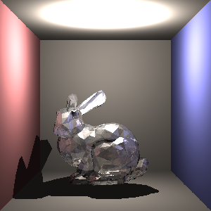
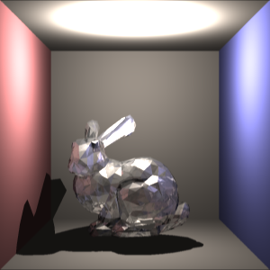

# 光线追踪大作业

王昊华 2020010942 计04

## 得分点

- [x] 算法选型
  - [x] RT光线跟踪
  - [ ] PT路径追踪
  - [ ] DRT分布式光线跟踪
  - [ ] PM光子映射
  - [ ] PPM渐进式光子映射
  - [ ] SPPM随机渐进式光子映射

- [ ] 参数曲面
- [ ] 复杂网格（是否有法向插值）
- [x] 加速算法
  - [x] AABB包围盒
  - [x] 层次包围盒

- [ ] 景深
- [x] 软阴影
- [x] 抗锯齿
  - [x] 超采样（抖动采样）
  - [x] 滤波器（高斯滤波器）

- [ ] 贴图
- [ ] 凹凸贴图
- [x] 运动模糊
- [ ] 体积光
- [ ] 体渲染
- [ ] 色散
- [ ] 焦散
- [ ] 其他

## 完成内容

- 算法：
  - [x] 光线投射Ray Casting（光源发出单光线与物体相交）：直接光Direct
  - [x] 光线跟踪Ray Tracing（跟踪视线发出单光线递归）：直接光Direct、间接光Indirect（反射、折射、阴影）
  - [ ] 路径追踪Path Tracing（蒙特卡洛算法实现多个随机光线递归）：（漫反射、ColorBleeding、软阴影、景深、运动模糊）
  - [ ] 光子映射Photon Mapping：（焦散Caustics）
- 几何求交
- 透视相机模型
- Phong模型着色：
  - [x] 漫反射Diffuse、镜面反射Specular
  - [x] 环境光Ambient
- Mesh网格模型
- 其他：
  - 求交加速：包围盒、层次包围盒、kd-tree、octree、hash
  - 抗锯齿：超采样Super-Sampling、高斯滤波器Gaussian blur filtering
  - 景深：光圈、焦距、物距
  - 运动模糊
  - 软阴影（面光源采样）
  - 纹理贴图：UV纹理映射、凹凸贴图
  - 色散、焦散
  - 体积光

## 使用框架

- 本课程PA1所给框架
- MIT [6.837 Intro to Computer Graphics, Fall 2004](http://groups.csail.mit.edu/graphics/classes/6.837/F04/index.html) 课程Assignment框架
- MIT [6.837 Computer Graphics, Fall 2012](https://ocw.mit.edu/courses/6-837-computer-graphics-fall-2012/pages/syllabus/) 课程Assignment框架

## 参考材料

- 本课程授课内容（课堂讲解 + 习题课）
- 书籍 [_Ray Tracing: The Next Week_](https://raytracing.github.io/books/RayTracingTheNextWeek.html)
- 

## 光线跟踪Ray Tracing

### 基础要求

增加了**环境光**、**反射**（漫反射和镜面反射）、**折射**（通过输入参数决定反射、折射的光线各占多少）、**阴影**（其中对半透明物体增加了**透色阴影**与**软阴影**）。

> 下面三幅图从左至右依次为**Ray Casting光线投射**、**Ray Tracing光线追踪**、Ray Tracing光线追踪开启**透色阴影**与**软阴影**模式：
>

### 抗锯齿Anti-aliasing

对光线追踪Ray Tracing算法增加了**抖动采样Jitter Sampling**、**高斯滤波器Gaussian Filtering**方法进行抗锯齿处理。

> 下面两幅图依次为**没有抗锯齿**处理的Ray Tracing光线追踪、**有抗锯齿**处理的Ray Tracing光线追踪（第一组为300\*300px、第二组为1600\*1600px）：

### 运动模糊Motion Blur

对光线投射Ray Casting、光线跟踪Ray Tracing中的球体Sphere物体均设置了运动模糊效果（继承自球体Sphere类的**移动球体MovingSphere类**）。

> 下面两幅图依次为Ray Tracing光线跟踪渲染出的**普通球体**（三个球均为Sphere）、**移动球体**（篮球、绿球为MovingSphere）效果：

### 加速算法

对光线跟踪Ray Tracing使用**BVH层次包围盒（Bounding Volume Hierarchy）**加速，即采用AABB包围盒（Axis-Aligned Bounding Box）作为划分依据建立树形结构对算法进行加速。

## 路径追踪Path Tracing

